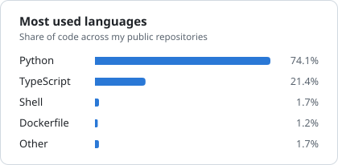

# Hi there, I'm Zeeshan Fahad 👋

## AI Engineer · Agentic AI, GenAI & Cloud Infrastructure

> Building intelligent, self-healing infrastructure where AI meets DevOps

🌐 [zeeshanlabs.com](https://zeeshanlabs.com) · ✍️ [Field Notes blog](https://zeeshanlabs.com/blog) · 💼 [LinkedIn](https://www.linkedin.com/in/zeeshanfahad)

I architect cloud platforms that don't just run—they think, learn, and heal themselves. With 6+ years of experience, I'm at the intersection of AI engineering and cloud infrastructure, creating systems that reduce toil and amplify human capability.

### 🚀 What I Do

- 🤖 **AI-Powered DevOps**: Building intelligent agents with LangChain, Vertex AI, and MCP for autonomous infrastructure management
- ☁️ **Multi-Cloud Architecture**: Designing scalable systems across GCP and AWS that handle millions of users
- 🔐 **Security-First Engineering**: Implementing RBAC, zero-trust architectures, and automated compliance
- 📊 **Observable Systems**: Creating unified monitoring with Grafana, Prometheus, and real-time anomaly detection
- 🎯 **Infrastructure as Code**: Terraform modules and Kubernetes CRDs that turn infrastructure into poetry

### 📌 Featured Projects

| Project | What it shows |
|---|---|
| [agent-observability-otel](https://github.com/Zeeshan-szf/agent-observability-otel) | OpenTelemetry tracing for AI agents: GenAI semantic conventions, MCP trace propagation (2026-07-28 spec), cost per run and tested Prometheus alerts |
| [Genai-Chat-Agent](https://github.com/Zeeshan-szf/Genai-Chat-Agent) | Multi-turn Gemini chat agent with tool calling, FastAPI + React, deployed on Cloud Run |
| [Automated-DevOps-Toolset](https://github.com/Zeeshan-szf/Automated-DevOps-Toolset) | Scripts that install and configure common DevOps tooling on Linux |

### ✍️ Latest Writing

- [How to Monitor AI Agents in Production with OpenTelemetry](https://zeeshanlabs.com/blog/ai-agents-observability-production) *(updated for the MCP 2026-07-28 spec)*
- [vLLM vs Ollama in 2026: Which LLM Serving Framework Should You Use in Production?](https://zeeshanlabs.com/blog/vllm-vs-ollama-production-2026)
- [Kubernetes Cost Optimization in 2026: From $50K to $22K/Month with Spot, VPA, and Karpenter](https://zeeshanlabs.com/blog/kubernetes-cost-optimization-2026)
- [Why 60% of GenAI Deployments Fail to Scale in 2026 (And How to Fix It)](https://zeeshanlabs.com/blog/genai-production-deployment-failures-2026)

More at [zeeshanlabs.com/blog](https://zeeshanlabs.com/blog).

### 💡 Recent Highlights

```yaml
achievements:
  - metric: "60%+ reduction in operational toil"
    method: "AI-driven automation and intelligent troubleshooting"
  
  - metric: "Zero downtime"
    context: "AWS to GCP migration for production OTT platform"
  
  - metric: "50% cost reduction"
    approach: "Strategic cloud architecture and resource optimization"
  
  - metric: "70% debugging accuracy improvement"
    tech: "RAG-based knowledge systems with historical incident data"
```

### 🛠️ Tech Stack

**AI & Intelligent Systems**
```
LangChain • Vertex AI (Gemini) • Model Context Protocol • RAG • AI Agents
```

**Cloud & Infrastructure**
```
GCP • AWS • GKE • EKS • Kubernetes • Terraform • Docker
```

**Observability & Security**
```
OpenTelemetry • Grafana • Prometheus • Loki • Cloudflare • RBAC • Aqua Security
```

**Data & Messaging**
```
PostgreSQL • Redis • RabbitMQ • MySQL
```

**Languages & Scripting**
```
Python • Bash • Groovy • YAML • HCL
```

### 🎯 What I'm Working On

**AI & Advanced Projects:**
- 🔬 **AI DevOps Assistant**: Multi-cluster Kubernetes automation using Vertex AI and MCP servers
- 📚 **RAG Troubleshooting Engine**: Context-aware debugging using historical incidents and SOPs
- 🏗️ **Custom K8s Operators**: Building CRDs for intelligent resource management

**Content & Community:**
- 📝 **Technical Writing**: [Field Notes](https://zeeshanlabs.com/blog) on AI agents, LLM serving and cloud cost
- 🚀 **Open Source**: Preparing production-grade tools to share with the community

### 🌟 Projects & Impact

**At Unilog** (Current):
- Built AI-powered DevOps assistant managing multi-cluster GKE operations
- Developed RAG-based troubleshooting engine with 70% accuracy improvement
- Automated infrastructure provisioning reducing deployment time by 75%
- Reduced operational workload by 60%+ through intelligent automation

**At Himalaya Hydro** (Previous):
- Orchestrated zero-downtime AWS to GCP migration for production OTT platform
- Achieved 50% cost reduction through strategic architecture optimization
- Developed custom Kubernetes CRDs for automated resource validation
- Reduced release times by 40% with advanced CI/CD pipelines

💡 **Open source versions of these tools coming soon!**

### 🏆 2026 Goals

- [x] Earn GCP Professional Cloud Architect certification ✅
- [ ] Open source 4+ production-grade DevOps tools
- [ ] Contribute to 5+ major open source projects (Kubernetes, Terraform, LangChain)
- [ ] Publish 12 technical blog posts on AI + DevOps *(4 published)*

### 🎓 Continuous Learning

**Certifications:**
- ✅ Google Cloud Professional Cloud Architect
- ☸️ Certified Kubernetes Administrator (CKA) *(in progress)*
- 🏗️ HashiCorp Terraform Associate *(in progress)*

**Current Focus Areas:**
- 🤖 AI Agents & Autonomous Systems
- 🔗 LangChain & Model Context Protocol
- ☸️ Advanced Kubernetes Patterns & Operators
- 💰 FinOps & Cloud Cost Optimization
- 🔐 Zero Trust Security Architecture

**Currently Reading:**
- 📚 "Building LLMs for Production" - Louis-François Bouchard & Louie Peters
- 📚 "Kubernetes Patterns" - Bilgin Ibryam & Roland Huß
- 📚 "Site Reliability Engineering" - Google

### 🎯 Open Source Journey

Currently preparing to share production-grade tools and contribute to the community. Focus areas:
- **AI + DevOps tooling** - Bringing intelligent automation to infrastructure
- **Kubernetes ecosystem** - CRDs, operators, and management tools
- **Terraform providers** - Multi-cloud infrastructure modules
- **Cloud Native projects** - CNCF sandbox contributions

**First one is live:** [agent-observability-otel](https://github.com/Zeeshan-szf/agent-observability-otel) ⭐

### 💭 Philosophy

```
"The best infrastructure is the one you never think about—
because it's intelligent enough to think for itself."
```

> The future isn't just automated—it's autonomous. I build systems that don't just execute commands; they understand intent, make decisions, and continuously improve. That's the intersection where I live.

---

[](https://holopin.io/@zeeshanszf)

<div align="center">

### ⚡ Fun Stats


**"First, solve the problem. Then, write the code." - John Johnson**

*Crafted with ❤️ and lots of ☕ in Kurnool, India*

### 📈 Top Languages

<picture>
  <source media="(prefers-color-scheme: dark)" srcset="cards/languages-dark.svg">
  
</picture>

### 💬 Let's Connect

I'm always excited to collaborate on projects at the intersection of AI and infrastructure, discuss cloud architecture, or help fellow engineers grow.

[](https://www.linkedin.com/in/zeeshanfahad)
[](mailto:zeeshan.szf@gmail.com)
[](https://zeeshanlabs.com)

</div>
